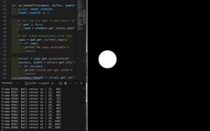

# py post

ways to move data from the gstreamer pipe to python post processing

* [idenity](./identity.md) explained 
    * see demo1: basic idenity
    
    ``` > python idenity_demo1_x86.py ```
    
    

    * see demo2:  idenity with TEE + The overlay is "burned in" to the video before it's encoded and sent over UDP!
    ``` 
        > python idenity_demo2_x86_send.py --port 5000 --draw-position
        > python idenity_demo2_x86_get.py --port 5000
    ```

* [appsink](./appsink.md)